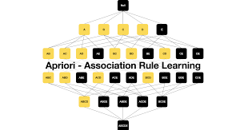
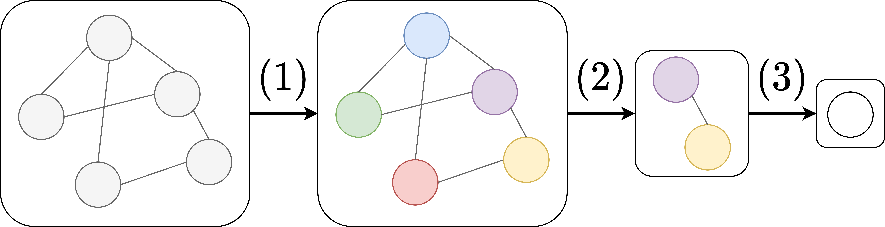

# 📦 Market Basket Analysis: Apriori, Eclat, and Graph Neural Networks (GNN)

This project demonstrates three distinct approaches for Market Basket Analysis using transactional data:

1. **Apriori Algorithm**
2. **Eclat Algorithm**
3. **Graph Neural Networks (GNN)**

Each method uncovers meaningful relationships between products based on their co-occurrence in customer transactions.

---

## 📌 Overview of Techniques

### 🧮 Apriori Algorithm

Apriori is a classic algorithm that identifies frequent itemsets and derives association rules from them. It works in a bottom-up manner, expanding frequent subsets step-by-step and pruning those that do not meet a minimum support threshold.

* **What it is**: A rule-based algorithm that discovers frequent item combinations and builds “if-then” rules.
* **How it works**: Expands itemsets level-by-level and uses support/confidence/lift to prune and rank them.
* **Use**: When rule-based insights and confidence/lift metrics are needed.
* **Strength**: Generates interpretable rules (e.g., “If bread, then milk”).
* **Limitation**: Can be computationally heavy with large datasets.

[Source: Wikimedia](https://commons.wikimedia.org/wiki/File:1_b1X3sV7WgElbWUZCYMOMrA.png))
### 🔢 Eclat Algorithm

Eclat (Equivalence Class Clustering and bottom-up Lattice Traversal) uses a vertical data format with Transaction ID sets (TID lists). It computes frequent itemsets based on intersections of TID sets, which can be faster and more memory-efficient than Apriori.

* **What it is**: A vertical-format mining algorithm using transaction ID sets (TID lists).
* **How it works**: Uses set intersections to find frequent itemsets efficiently.
* **Use**: When fast mining is needed without needing explicit rules.
* **Strength**: Efficient mining of frequent itemsets.
* **Limitation**: Doesn’t directly generate association rules.

### 🔗 Graph Neural Networks (GNN)

GNNs model items and baskets as nodes in a bipartite graph. The model learns vector representations (embeddings) for each item based on their graph context (e.g., which baskets they appear in). These embeddings are used to compute item similarities.

* **What it is**: A deep learning model that learns vector representations (embeddings) of items based on their presence in transactions (baskets).
* **How it works**: Items and baskets form a graph, and a GCN learns embeddings. Then cosine similarity between embeddings shows related items.
* **Use**: When you want embedding-based recommendations and pattern discovery.
* **Strength**: Captures complex co-purchase patterns.
* **Limitation**: Less interpretable than rule-based methods.

[Source: Wikimedia](https://commons.wikimedia.org/wiki/File:GNN_building_blocks.png))
---

## 🔄 Complete Workflow

### Step 1: Load Basket Data

* Load a CSV file where each row contains a comma-separated list of items purchased together.

### Step 2: Apply Apriori

* One-hot encode transaction data.
* Use the Apriori algorithm to find frequent itemsets.
* Generate association rules using metrics like confidence and lift.

### Step 3: Apply Eclat

* Convert the transaction list into a vertical TID format.
* Identify frequent itemsets based on intersection of TID sets.
* (Optional) Generate rules manually based on support.

### Step 4: Apply GNN

* Create a bipartite graph of baskets and items.
* Use a GCN model to learn embeddings.
* Use cosine similarity to find related items.

### Step 5: Interpret Results

* Apriori gives clear rules: “if A then B with 70% confidence”.
* Eclat gives you the most frequent co-purchased itemsets.
* GNN gives embeddings that help find items purchased in similar shopping contexts.

---

## 💼 Use Cases

* Personalized product recommendations
* Cross-sell and up-sell strategies
* Market segmentation
* Retail inventory optimization

---

## ▶️ How to Run

* Place your `groceries.csv` file in the working directory.
* Run individual scripts for Apriori, Eclat, or GNN.
* View printed results for rules, frequent itemsets, or similar items.

---

